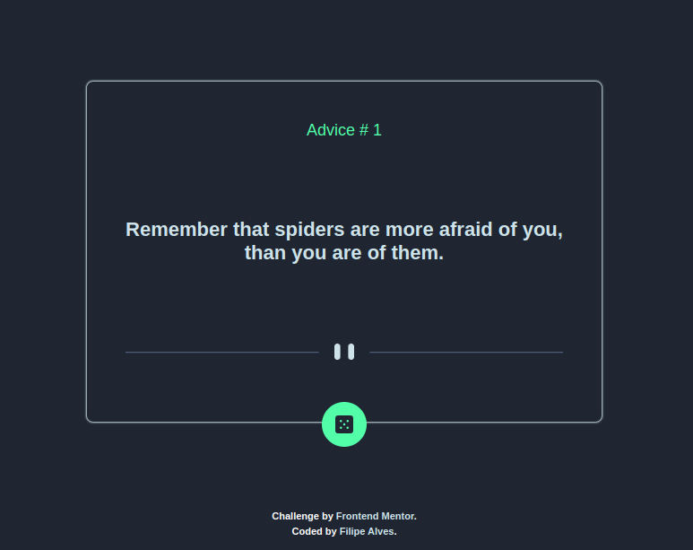
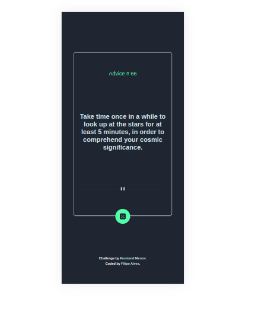
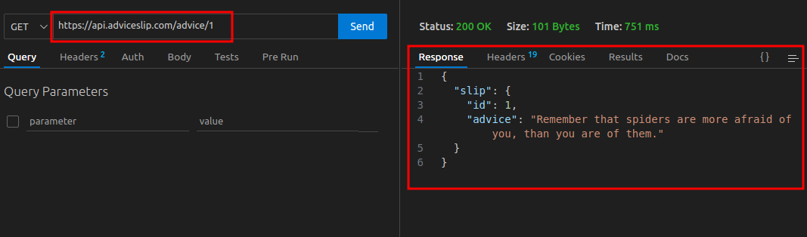

# Welcome! 👋

## Frontend Mentor - Advice generator app solution

Esta é uma solução para o [Advice generator app solution challenge on Frontend Mentor](https://www.frontendmentor.io/challenges/advice-generator-app-QdUG-13db). Os desafios do Frontend Mentor ajudam você a melhorar suas habilidades de codificação através da construção de projetos realistas.

### Índice

- [Visão geral](#visão-geral)
  - [O desafio](#o-desafio)
  - [Screenshot](#screenshot)
  - [Links](#links)
- [Desenvolvimento](#desenvolvimento)
  - [Tecnologias](#tecnologias)
  - [Aprendizado](#aprendizado)
  - [Próximos Passos](#próximos-passos)
- [Autor](#autor)

### Visão geral

#### O desafio

- Construir uma aplicação geradora de conselho usando a API Advice Slip.
  - Layout responsivo;
  - Ter os estados de foco para todos os elementos interativos na página;
  - Gerar um novo conselho clicando no ícone de dado.

#### Screenshot




#### Links

- Solution URL: [Interactive rating component](https://interactive-rating-component-omega-mauve.vercel.app/)

### Desenvolvimento

#### Tecnologias

- HTML5 semântica
- CSS
- Flexbox
- Layout Responsivo
- [React](https://reactjs.org/) - Documentação
- [Axios](https://axios-http.com/ptbr/docs/intro) - Documentação

#### Aprendizado

Esse projeto tem como objetivo praticar o desenvolvimento web com React, o principal conceito colocado em prática foi o comsumo de Api utilizando  Axios(Cliente HTTP baseado em promise para o navegador e Node.js), que foi utilizado para buscar dados da API Advice Slip .

- Exemplo de parte do código usado para acessar a api:

```js
import axios from "axios";

const api = axios.create(
    {
        baseURL:'https://api.adviceslip.com/advice',
    }
)
export default api;
```

- Exemplo exemplo do resultado da requisição:



#### Próximos Passos

Continuarei estudando ReactJs, e meu próximo objetivo é usar styled-components nos projetos.

### Autor

- Linkedin - [Filipe Alves](https://www.linkedin.com/in/filipeqalves/)
- Frontend Mentor - [@lipeqalves](https://www.frontendmentor.io/profile/lipeqalves)
